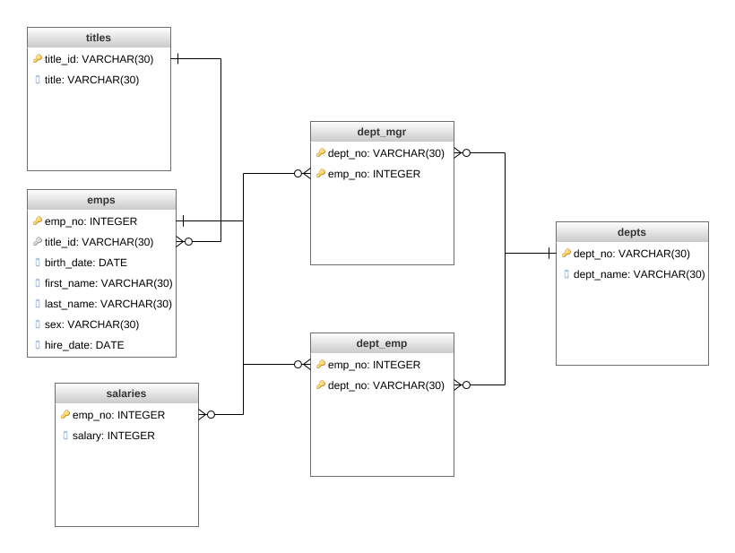
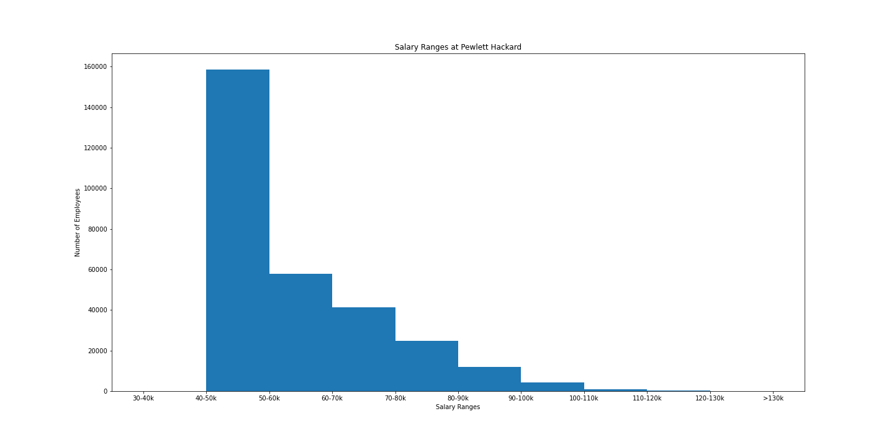
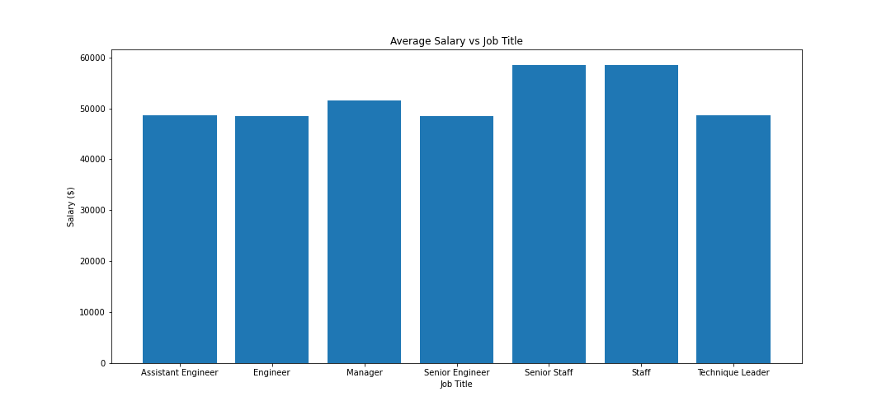

# SQL_Challenge

## Creating ERD & Schema
Using employee data from a fictional electronics company, designed an ERD diagram conforming to 3NF and exported schema using GenMyModel.

## Creating Database
Exported schema into SQL file on PostgreSQL server, created tables, imported CSVs, and established relationships. 

## Querying
Completed the following queries:

  1. List the following details of each employee: employee number, last name, first name, sex, and salary.

  2. List first name, last name, and hire date for employees who were hired in 1986.

  3. List the manager of each department with the following information: department number, department name, the manager's employee number, last name, first name.

  4. List the department of each employee with the following information: employee number, last name, first name, and department name.

  5. List first name, last name, and sex for employees whose first name is "Hercules" and last names begin with "B."

  6. List all employees in the Sales department, including their employee number, last name, first name, and department name.

  7. List all employees in the Sales and Development departments, including their employee number, last name, first name, and department name.

  8. In descending order, list the frequency count of employee last names, i.e., how many employees share each last name.
  
  ## Additional Analysis (Bonus)
  Exported data into a Pandas DataFrame and created visualizations analyzing the most common salary ranges for employees, and the average salary by title.
    
   
   
   
